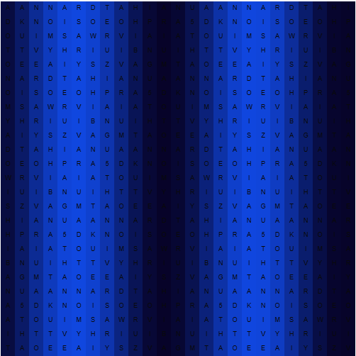
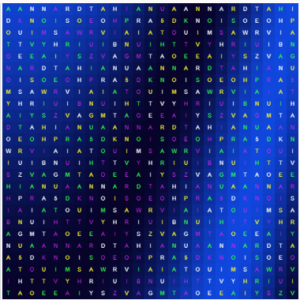
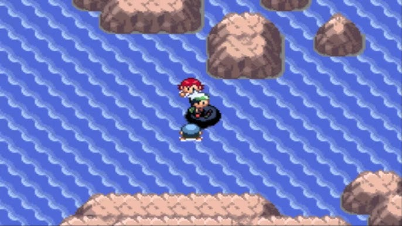
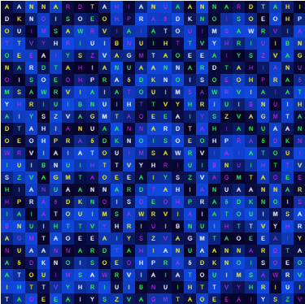
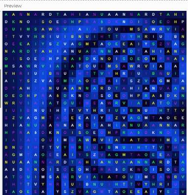

# Experiment 1: Find a 2d design or visual pattern that inspires you

## Version 1
Unfortunately, I did not save any screenshots of the initial version, although can describe how it worked functionally. For future experiments however, I have ensured I have evidence of the base versions, as well as the later iterations of each experiment.

This project was inspired by Andrew Gysin and his collaboration with SEIBU Shibuya where he presented his "meltdown" digital artwork. In this artwork, he used a blue theming, combined with proceedural ASCII art that was changed / manipulated over time to form moving shapes. 

I felt heavily inspired by this artwork due to a visit to Shibuya a few months before discovering the artwork, so decided it was complex enough and intreaguing enough to utilise it within my own adaption.

During the design phases, I needed a way to seperate this artwork from "just another copy of Andrew Gysin's work". While considering appropiate alternatives, I realised that a Japanese "Secretive Singer" had very similar brand designs, and begun imagining concepts. (Davies, 2026)

> **Context: The Japanese Secretive Singer**  
> Ado is a Japanese Singer based in Tokyo who is known for her undeniable vocal skills and secretive identity who I have been following the journey of since the debut of her album "歌ってみたアルバム" in 2023. (Ado, 2023)
> [Ado on Wikipedia (Community-ran)](https://en.wikipedia.org/wiki/Ado_(singer))  
> Ado on [YouTube](https://www.youtube.com/channel/UCln9P4Qm3-EAY4aiEPmRwEA) / [NicoNico](https://www.nicovideo.jp/user/39170211/video?ref=pc_userpage_menu)

# Technical Review - Version 1
> Disclaimer: As described earlier, there are no screenshots to showcase the development nor completion of this version. You can, however, see the remains of the base code within the later versions  

The initial version and foundation of the "AdoWave" showcased a 15x15 square grid, formed of "Square()" shapes, and "Text()" elements centered in the middle of them. Initially, this started without any form of array, although I quickly discovered that to be able to identify where a "block" actually is, I would need to make an 2D array of the individual blocks that I can later reference. *Spoiler: The approach of using a 2D array was scrapped as it was over-the-top for what it was needed for.*

# Technical Review - Version 2
[View the Version 2 p5.js Code](https://editor.p5js.org/uklewis124/full/w5AfCormo)  
  

  
For the second iteration, I wanted to intoduce a combination of animation over time, and improved color logic.

**Animation Logic**  
The animation works by introducing an "offset" variable that increments every frame (offset += 0.05). To acheive changes in speed, this offset can be adjusted either manually, or via automation to adapt the speed the animation changes. For example, changing the offset from 0.05 to 0.5 means that the offset of the "start location of the animation" gets increased by half a square, rather than 0.05 parts of a square each frame.  
  
To create the wave effect in the background, I used the "sin()" function inside by "getCellStyle()" function. Because the sine wave returns values -1 to 1, I used the "map()" function to translate those values into 0 to 1. Finally, I used "lerpColor()" to smoothly transition the background colors of each square between `#000` and `#2110C9`.  
  
**Experimentation & Problem Solving**
The primary goal was to make the static grid feel alive, mimicking the energy of a live Ado concert while still keeping its routes embedded in Gysin's ascii art. The biggest technical issue I faced was working out the correct mathematical equations and technical solutions to running the animation. I originally started with a grid system, although I failed to actually save the changes made to the grid each time, meaning it never iterated past its original state. I was later suggested that I use the built-in sin() function, which did exactly what I was trying to manually create.

**Improvements to be made**
I also tried to create a dynamic text gradient across the grid. My logic was to read the RGB values of neighboring cells (e.g., cellLeft = grid[x-1][y]) and incrementally add to them. However, during testing, I realized that this code was non-functional. The code did not work because the grid values were initialized during setup, but then never overwritten during the draw() loop, meaning the calculation simply evaluates to 0 + 10 (```rgb(10, 10, 10)```) each time. While the logic failed, identifying this flaw reminded me the importance of ensuring your data is persistant within loops and arrays.

# Technical Review - Version 3
[View the version 3 code](https://editor.p5js.org/uklewis124/full/J06YuubbO)  
  
  
  
For the third iteration, I worked on manipulating the existing gradient engine and seeing how mathematics will affect the design.  
  
**Gradient Experimentation**  
At first, I experimented with my gradient system from version 2, working out how I can get the direction of the gradient to change. I don't really understand how geometry works beyond GCSE-level "x = y" straight line graphs, although I did discover that using the exact geometry taught in those lessons within the "mouseInteractionVal" variable showed the same results as a graph actually would in reality.  
  
**Colors**  
I also experimented with the use of text-color, creating a static TV style effect which subtly hints at the show-biz industry dynamics. To do this, I used a combined the use of random(), which also can randomize p5.js colors, and 4 seperate high-contrast colors.  
`cliColors = [color("#2EFF51"), color("#FAFFFB"), color("#F4F52C"), color("#DB2CF5")];`  
  
**Accidental Perfection**  
Perfection is entirely the wrong word to use here, although it does go to prove how pure experimentation. With the gradients, I discovered some cool animations the graphs could do. Varying from static grid-like patterns, and "tons of circles" changing on the screen. While the curved gradient that is presented on the work at the moment is the format I prefer, the others have potential to be used as alternative varients in the future.  
  
By changing the multiplier in mouseIntervalVal from the existing 0.1 to 5 for example, you can get an animation that reminds me of the water in the Pokemon Gameboy series.

  
Pokemon Emerald Water (heavybass, 2016)  
  
  
The similar water layout.  

  
A shape that closely resembles the german ß letter by replacing + with *.  
`let mouseInteractionVal = x*x*0.1 * y`  
  
# Critical Evaluation  
Overall, this project represents a clearly unique design style, combining brand and wording from Ado, with exploring how to use the novelty of ASCII art to create otherwise interesting art pieces. There is room for improvement, including through allowing greater user interactivity, and by clearing out un-used code elements. 

### References
Davies, L. (2026) S1: Creative Coder Study. An Assessment Submission.  
Ado (2023) Adoの歌ってみたアルバム. Tokyo: CloudNine. Available at: https://open.spotify.com/album/2tGokYNjX87AAodtbLBYuf.  
heavybass (2016) Pokemon Emerald (GBA) Part 83 - The Final Swim, YouTube. Available at: https://www.youtube.com/watch?v=0Ip22NNlQ0g (Accessed: 17 May 2026).