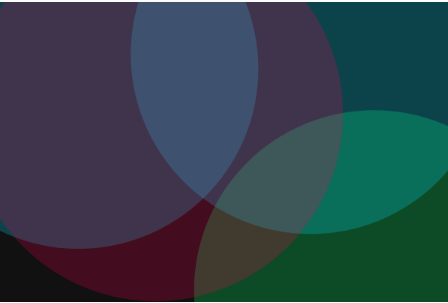
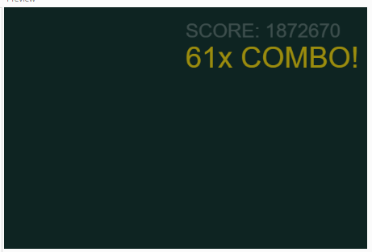

# Experiment 2: A keyboard driven visual and audio instrument - see Patatap where a keystroke triggers different effects 

[View live example (May not work due to p5 audio library)](live/experiment2/)
[View p5 editor](https://editor.p5js.org/uklewis124/full/HKzoZqaqn)

## Version 1  
My inspiration behind this project is, well, patatap. However, I haven't played patatap in long over a month, so instead I will use varying keys to control different aspects of the game such as color, design, and shape creation.  
  
This version features visual-only animations when the user presses letters or numbers. In addition, the background will change to a randomized dark background when the spacebar is pressed.  
  
Exploring the code, the shapes are created using a "Shape" class, which handles logic for each shape individually, and allows dynamic changes and action to each shape without manually creating new variables. These shapes are added to a "shapes" array, allowing the program to iterate through each shape, triggering the next "frame" to generate, and deleting the shape if it is not visible anymore.  
  
Due to a limitation of p5.js, the *whole canvas* gets rotated rather than just the class object. So, to work around that, the square is "created" at the central point of the canvas (0,0), and then "translated" (moved) to its actual randomized point. This allows me to reference that point, and rotate the square against that point, instead of swinging around out side of the canvas.  
  
**Next steps: Adding audio**  
  

## Version 2  
For this version, I focused on audio. To meet the requirements of the task, the project must become both an audio and visual instrument.  
  
To do this, I used the built-in "PolySynth" p5 library. *Note: using the p5 library within a standalone HTML file does not work, so this project will forever show as "loading". To load the project, simply drag my code into the p5.js editor, or visit the live p5 link.*  
  
When a key is pressed, the polysynth will play a musical note tied to the varient of they they pressed. The numbers act as a musical scale, allowing the user to press 0 (the lowest) or press 9 (the highest) with notes playing in musical order.  
  
When the space bar is pressed, a deep bass tone is played.  
  
When the alphabet keys are pressed, a random melodic tone is played.  
  
**Technical Fixes**  
As the number keys do not simply go from "0 to 9", i used the map() function to convert 48 to 57 into 0 to 9.  
  
**Next Steps: Gamify it!**  

## Version 3  
For this version, I completely flipped the expectations of the project, and gamified it. The typical process would be to over-complicate one specific feature, in the hopes of ticking a checkbox that isn't garunteed to be checked. Instead, with this version I am focusing on creativity. Additionally, this could be considered similar to Gysin's work due to him also flipping expectations.  
  
To do this, I introduce global variables "score, combo, lastKeyTime". Inside the keyPressed() function, every genuine key press adds to the total score (score += (1 * combo)). To add a sense of urgency, I introduced the lastKeyTime variable, which is compared against the current time to check if 1.5 seconds has been passed since the last valid keypress. If this duration is passed, the combo is zeroed off and must be restarted. Finally, I added a score and combo text to the screen, which lets you know how many times (including with multiplier) you have pressed a key. When the combo is triggered, using size and a sin wave, the bonus grows and shrinks demanding your attention.  
  

  
## Critical Evaluation
Overall, this project highlights how such simple mechanics can create an otherwise interesting interactive media. Unfortunately however, the game mechanics still lack a particular reason to exist, and should instead perhaps be tied to rythm game mechanics, where you must tap along to a pre-defined rythm to succeed. Regardless, I consider this experiment a large success dispite its potential for improvement.