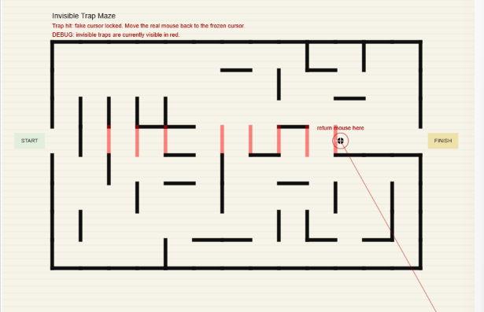

# Experiment 3: An interactive and complex system of behaviour, with many independent elements, making use of classes to represent ideas or elements.

[View live example (May not work due to p5 audio library)](live/experiment3/)
[See live on p5 editor](https://editor.p5js.org/uklewis124/full/0vIkQtuuG)
  
## Version 1  
This experiment explicitly encourages the use of AI, with the brief allowing 70% AI creation, 30% User creation. To meet this request, I will be generating the first portion of the project - the base - entirely using AI and prompts to fix it. "Vibe Coding". Afterwards, I will explain what the code it has made does at a high-level, and then iterate without the use of AI for version 2 and 3.  
  
Some issues I faced with vibe coding, was that the AI was not able to "visualise" what the code was actually doing, so instead showed mazes with wide open areas, and did not actually resemble any maze. After further instruction, and suggesting my own fixes regularly, we managed to get it to a suitable standard for me to take over with.  
  
  
The user must navigate a maze using their cursor. If you hit a wall, your cursor will freeze, and you need to drag your mouse back away from the wall. In addition, there are invisible walls. You must continue to navigate while remembering where those invisible walls are located and reach the finish point.  
  
The code utilizes a proceedurally (and randomly) generated maze, including invisible walls.  
  
## Version 2  
From this point on, all work is my own, not the result (or support) of generative technologies.  
  
So, deciding on a version 2 was not fun. The AI actually did such a good job of the maze, that I struggled to find any meaningful changes I could make to improve. So instead of wondering aimlessly, I decided that I am going to actively increase difficulty with every iteration. For iteration 2, I included a spotlight that only shows you the immediate area around you.  
  
Creating an inverted shape is interesting. I discovered you can't just overlay a circle onto a pitch black background like I would with photoshop, so after searching the p5 documentation, I discovered "vertex()".  In short, I create a new canvas for this vertex (like creating a rectangle in Photoshop). At this point, I realized that theres no easy "make a hole" command, so I instead created a dot-to-dot edge (using beginContour()), using a for loop to repeat until a full circle is complete, and sin() cos() to place a vertex point at each step around the player. I don't quite understand the maths here, and instead referenced the p5 examples on their documentation. This is where I discovered that cos is effectively paralell to sin, where I can use cos as an x axis, and sin as a y axis, to decide where to place my vertex points. (p5.js, 2025)  
  
## Version 3  
  
For version 3, I decided to add two final tweaks. The first is a timer to create a sense of urgency, where the user must navigate the maze in less than 20 seconds or else they will fail and need to restart. This part was very easy to implement, as all I needed was to write a formatted version of the millis(), combined with a check to see if 20 seconds has been exceeded.  
  
Finally, I added a "cheat" for users to make it actually possible to complete the maze. If the user presses the left mouse button, they may activate a "radar" (showing the location of every invisible wall you are near), although is only usable if you have less than 10 seconds remaining. In addition, there is a 4 second cooldown between uses, making timing an extremely important game mechanic.

## Critical Evaluation
This experiment was extremely interesting, using AI as a co-pilot in an academic context, rather than hand-building everything. By allowing the AI to handle the brute-force of complex proceedural generation and collision logic for the maze template, I was able to shave off a significant amount of time allowing me to innovate instead.  
  
To claim my 30% ownership, I used my own suggestions to steer the AI towards a design that fit my own vison rather than pre-existing examples. In addition, I also programmed a spotlight effect, radar system, and timer system to convert the game from a peaceful newspaper advert to a rage-baiting death-induced game throwing people out of their seats.  
  
Overall, the project was a huge success, teaching me the value of not needing to write *every line of code*, and know *every complex maths equation* to be able to create projects. Instead, you just need to know how to manipulate logic to shape the project into your own vision.

## AI Disclaimer
I have used AI in this example for the entirety of Version 1. Through assisted guidance, ChatGPT has created the base "maze" engine. After version 1 (Version 2 & 3), I have completed any changes on my own without the assitance of AI or other generative technologies. For the purpose of auditing, I have listed the entire conversation below as a link. (OpenAI, 2026)

OpenAI (2026) ChatGPT - Invisible Trap Maze Code, ChatGPT. Available at: https://chatgpt.com/share/6a0a88ff-5478-83eb-90e0-6b6f6333b651 (Accessed: 18 May 2026).

## References
OpenAI (2026) ChatGPT - Invisible Trap Maze Code, ChatGPT. Available at: https://chatgpt.com/share/6a0a88ff-5478-83eb-90e0-6b6f6333b651 (Accessed: 18 May 2026).  
p5.js (2025) Sine and Cosine, P5js.org. Available at: https://p5js.org/examples/angles-and-motion-sine-cosine/.